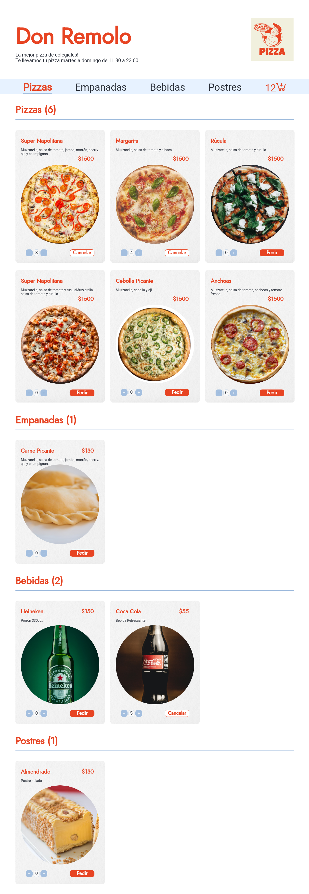
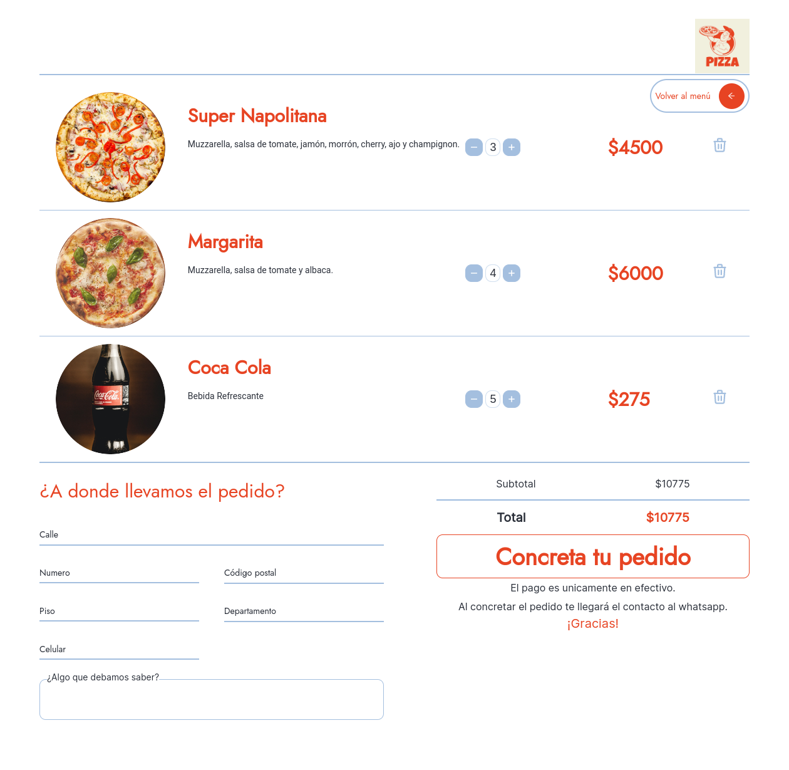

# PROYECTO: PIZZERÍA DON REMOLO

Esta es una solución para el proyecto de la [idea #3](https://idforideas.com/) de Id for Ideas.

## Overview

### The challenge

#### Descripción del proyecto

Se requiere un menú intuitivo y simple de usar para realizar pedidos vía whatsapp.

#### Objetivo

El usuario final debe poder armar su pedido online con todos los ítems agregados,
conocer su total, y recibir confirmación del local.  

#### Requisitos

- Los usuarios no necesitan estar registrados.
- Se debe poder visualizar el listado de comidas ofrecidas separadas en categorías:
Pizzas, Empanadas, Bebidas, Postres.
- El usuario debe poder agregar X cantidad de cada item en su pedido.
- El pedido puede realizar su checkout sin pago ni envío de por medio. Se debe aclarar
que es sólo en efectivo y con delivery propio del negocio.
- En el checkout se crea un texto automático que se envía al whatsapp del local.

### Screenshot

### Links

- Live Site URL: [Pizzería Don Remolo](https://don-remolo-pizzeria.vercel.app/)

## My process

### Built with

- Semantic HTML5 markup
- CSS custom properties
- Flexbox
- CSS Grid
- Mobile-first workflow
- [React](https://reactjs.org/) - JS library
- [React-Router-Dom](https://reactrouter.com/en/main)
- [React-Icons](https://react-icons.github.io/react-icons/)
- [React-Intersection-Observer](https://react-intersection-observer.vercel.app/)

## Author

- Project Manager - Antonio Lefinir
- Diseñadora - [Cintia Fernandez Padin](https://www.linkedin.com/in/cintia-fernandez-padin-44a60874/)
- Frontend - [Luis Medina](https://www.linkedin.com/in/luis-medina-dev/)
- Frontend - [Andrés Pulupa](https://www.linkedin.com/in/andres-pulupa/)
- Backend - [Geraldson Perez](https://www.linkedin.com/in/geraldsonperez/)
- QA - [Carlos Mangles](https://www.linkedin.com/in/carlosmangles/)
- QA - [Gaston Timchuk Bilik](https://www.linkedin.com/in/gastontimchuk/)
- QA - [Paula Scaglia](https://www.linkedin.com/in/paula-scaglia-qa/) 
